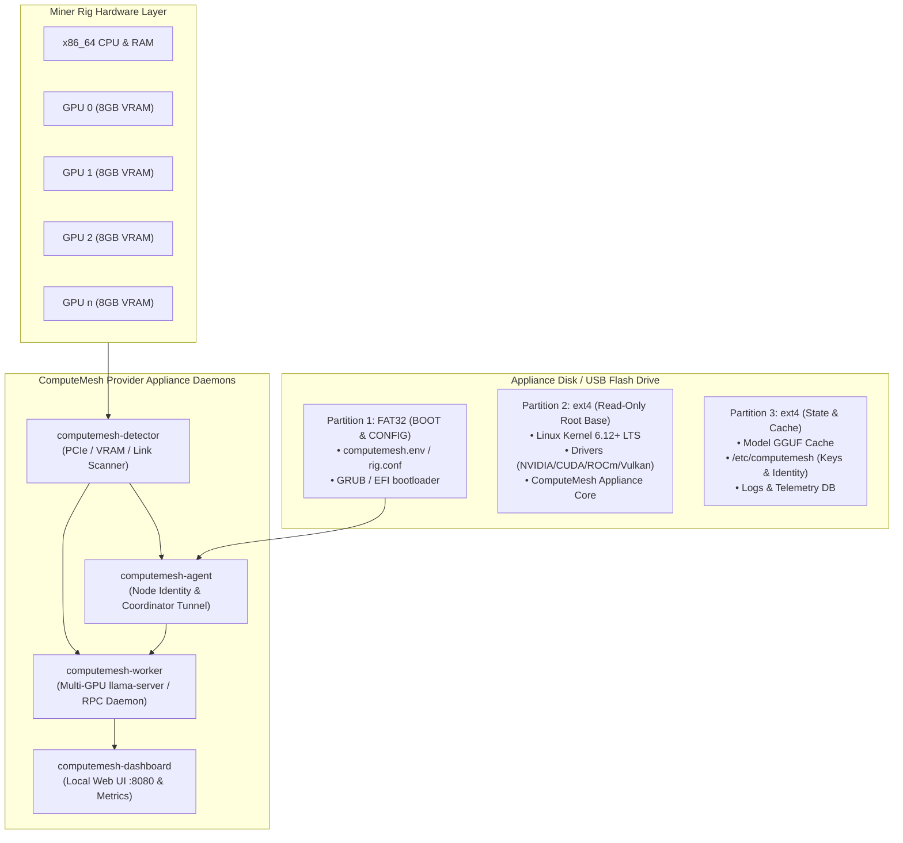

# ComputeMesh NodeOS: Mining Rig Provider Appliance & Installer

## 1. Executive Summary & Vision

Thousands of decommissioned cryptocurrency mining rigs (formerly running HiveOS, SimpleMining, or headless Linux) sit idle with **4 to 12 GPUs each (typically 8 GB VRAM per card)**. While their **PCIe 1x risers** make high-bandwidth training or continuous weight streaming impractical, **distributed layer-sharded LLM inference** requires only transferring small activation tensors (~few kilobytes per token) across cards. 

A standard 5× 8 GB GPU rig represents **40 GB of aggregated VRAM**—more than enough to host 7B, 14B, or 32B quantized models (such as Qwen 2.5, Llama 3.1, Mistral, and DeepSeek distilled models) and earn ComputeMesh inference credits or revenue.

**ComputeMesh NodeOS** is an appliance-grade, flash-and-boot operating system image and automated installer designed to turn any multi-GPU rig into an autonomous, self-configuring ComputeMesh provider node.

---

## 2. Hardware Architecture & Inference Feasibility

### 2.1 PCIe 1x Risers vs. Activation Tensor Bandwidth
- **The PCIe 1x Reality:** Mining risers operate at PCIe Gen 2 (500 MB/s) or Gen 3 (985 MB/s).
- **Weight Loading vs. Inference:** 
  - Weight loading happens once at startup (loading 4–6 GB onto an 8 GB card takes ~5–8 seconds over PCIe 1x).
  - Intra-GPU layer execution occurs directly in high-bandwidth VRAM (256–512 GB/s per card).
  - Inter-layer activation tensors for sequence evaluation are small: a 7B model hidden dimension ($d = 3584$, FP16) transfers **only 7.1 KB per token**. Over a 500 MB/s PCIe 1x bus, transmitting 7.1 KB takes **0.014 milliseconds**, adding virtually zero latency to token generation!

### 2.2 Supported Hardware Matrix

| Hardware Class | Supported GPU Models | Memory | Recommended Driver Stack | Primary Inference Engine |
| :--- | :--- | :--- | :--- | :--- |
| **NVIDIA Pascal** | GTX 1060 6GB, 1070/1080 8GB, 1080 Ti 11GB, P106-100, P104-100, P102-100 | 6–11 GB | NVIDIA Headless 535 / 550 + CUDA 12.2 | `llama.cpp` CUDA / cuBLAS |
| **NVIDIA Turing** | GTX 1660 Super/Ti 6GB, RTX 2060 6/12GB, RTX 2070/2080 8GB, CMP 30HX/40HX/50HX | 6–12 GB | NVIDIA Headless 550+ + CUDA 12.4 | `llama.cpp` CUDA / Flash-Attention |
| **NVIDIA Ampere/Ada** | RTX 3060 12GB, RTX 3070/3080 8–12GB, RTX 3090 24GB, A2000/A4000, CMP 90HX/170HX, RTX 40-series | 8–24 GB | NVIDIA Headless 550+ + CUDA 12.4 | `llama.cpp` CUDA + Graph Compute |
| **AMD Polaris** | RX 470/480/570/580/590 8GB | 8 GB | Mesa 24.x Vulkan (RADV) / OpenCL / ROCm 5.x | `llama.cpp` Vulkan / OpenCL |
| **AMD Vega & RDNA 1/2/3** | Vega 56/64, Radeon VII, RX 5700 XT, RX 6600–6900 XT, RX 7600–7900 XTX | 8–24 GB | AMD ROCm 6.x + Mesa Vulkan | `llama.cpp` ROCm / Vulkan |
| **Intel Arc** | Arc A380 (6GB), A580/A750/A770 (8–16GB) | 6–16 GB | Intel Level-Zero / OneAPI + Mesa ANV | `llama.cpp` SYCL / Vulkan |

---

## 3. Appliance Architecture



---

## 4. User Experience & Flashing Workflow (The HiveOS Experience)

### 4.1 Quick-Start for Miners (Flash & Boot)

1. **Download Image:** Download `computemesh-nodeos-x86_64-v1.0.img.xz` (~1.8 GB).
2. **Flash:** Write image to a USB flash drive (16 GB+) or internal SSD using **Rufus**, **BalenaEtcher**, **Raspberry Pi Imager**, or `dd`:
   ```bash
   xzcat computemesh-nodeos-x86_64-v1.0.img.xz | sudo dd of=/dev/sdX bs=4M status=progress
   ```
3. **Configure (Optional before boot):**
   - Insert USB into Windows/Mac. A drive named `CM-BOOT` appears.
   - Open `computemesh.env` and set provider wallet / cluster token:
     ```ini
     PROVIDER_ACCOUNT_ID=cm_provider_0x71a9...
     RIG_NAME=mining-rig-01
     COORDINATOR_HOST=mesh.computemesh.net
     NETWORK_MODE=dhcp
     ENABLE_WEB_UI=true
     WEB_UI_PORT=8080
     ```
4. **Boot Rig:** Connect Ethernet and power on.
   - Automatic headless startup.
   - Rig discovers all GPUs, captures inventory, generates Ed25519 identity, opens local Web UI at `http://<rig-ip>:8080`, and announces capacity to ComputeMesh coordinator.

---

## 5. Local Web Dashboard (`:8080`)

The appliance hosts an embedded, lightweight status interface:
- **GPU Matrix:** Per-GPU status, temperature, fan speed, power watts, VRAM allocation, PCIe link speed.
- **Inference Telemetry:** Active model, layer sharding distribution, tokens processed, active coordinator sessions.
- **Node Wallet & Ledger:** Verified compute units served, settlement state, earnings balance.
- **System Tools:** One-click driver check, benchmark rerun, log viewer, reboot/shutdown.

---

## 6. Implementation Plan & Delivery Phases

### Phase 1: Appliance Core & Hardware Detector (`tools/appliance`)
- `hardware_detector.py`: Scans PCI topology, PCIe link generation/width, VRAM sizes, vendor driver backends, generating standardized `node_inventory.json`.
- `multi_gpu_launcher.py`: Automatically configures `llama-server` / `ggml-rpc-server` tensor split parameters across all discovered healthy GPUs.
- `appliance_config.py`: Parser for `/boot/computemesh.env` with fallback to interactive terminal/web setup.

### Phase 2: Lightweight Embedded Dashboard (`services/appliance_dashboard`)
- Zero-dependency Python HTTP / WebSockets dashboard serving responsive dark-mode monitoring UI with real-time GPU thermals and inference metrics.

### Phase 3: Online Installer Script (`setup/INSTALL-APPLIANCE.sh`)
- Automated one-line installer for existing running HiveOS, Ubuntu, or Debian installations:
  ```bash
  curl -fsSL https://get.computemesh.net/install.sh | sudo bash
  ```
- Installs drivers, ComputeMesh systemd services, watchdog, and registers the node.

### Phase 4: Bootable Raw Disk Image & ISO Builder (`deploy/appliance/`)
- Reproducible `debootstrap` + `packer` / `genisoimage` script creating `.img.xz` and `.iso` appliance builds with BIOS/UEFI dual-boot support.
