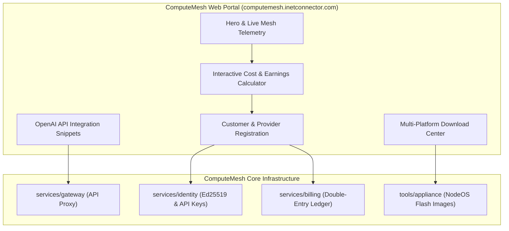

# ComputeMesh Public Web Portal & Customer Billing Specification

## 1. Executive Summary & Domain Scope

The **ComputeMesh Public Web Portal** is the official public gateway for customers, developers, and hardware providers, hosted at `computemesh.inetconnector.com` (transitioning to `computemesh.com`).

The portal serves three key user personas:
1. **AI Developers & Businesses (Consumers):** Access high-performance, cost-effective LLM inference via OpenAI-compatible endpoints (`https://api.computemesh.com/v1`), manage API keys, and purchase prepaid compute credits.
2. **Hardware & Mining Rig Providers (Suppliers):** Download one-click installers for Windows, Linux, and dedicated multi-GPU Mining Rig OS images (NodeOS), connect hardware to the mesh, and monitor automated revenue payouts.
3. **General Public & Community:** Understand the technology, explore the decentralized architecture, check live network status, and review security/transparency guarantees.

---

## 2. Localization & Multi-Language Architecture (DE / EN)

The portal provides first-class bilingual support:
- **German (DE):** Tailored for European/DACH hardware providers, enterprise customers, and local mining communities.
- **English (EN):** Default international interface for global developers, researchers, and decentralized compute participants.
- **Dynamic Translation Engine:** Zero-latency client-side switching using a unified JSON translation registry, preserving user state, form inputs, and active calculators.

---

## 3. Core Modules & User Journeys

### 3.1 One-Click Download Center
- **Windows x64:** `ComputeMesh-Provider-Setup.exe` (tray background agent with CUDA auto-detect).
- **Linux Headless:** `curl -fsSL https://get.computemesh.net/install.sh | sudo bash` (automated systemd service).
- **Mining Rig Appliance (NodeOS):** `computemesh-nodeos-x86_64.img.xz` (flashable via Rufus / BalenaEtcher with FAT32 configuration partition).

### 3.2 Automated Billing & Ledger Invariants
- **Double-Entry Ledger:** All credit transactions follow append-only double-entry bookkeeping (`debit = credit`).
- **Base Units:** Credits are denominated in fixed-point integer micro-units (`1 Compute Credit (CM) = 1,000,000 micro-credits`).
- **Provider Settlement:** Automated batched settlement when provider earnings exceed the minimum payout threshold ($25 equivalent).
- **Consumer Metering:** Billed per 1,000 input/output tokens based on model size and latency tier.

---

## 4. Security & Privacy Guarantees

- **Zero Prompt Storage:** Gateway streams tokens directly without persisting user prompts or outputs to disk.
- **Non-Custodial Provider Keys:** Hardware nodes generate and hold their private Ed25519 identity keys locally.
- **Encrypted Channels:** All customer API and provider telemetry traffic strictly requires TLS 1.3.
